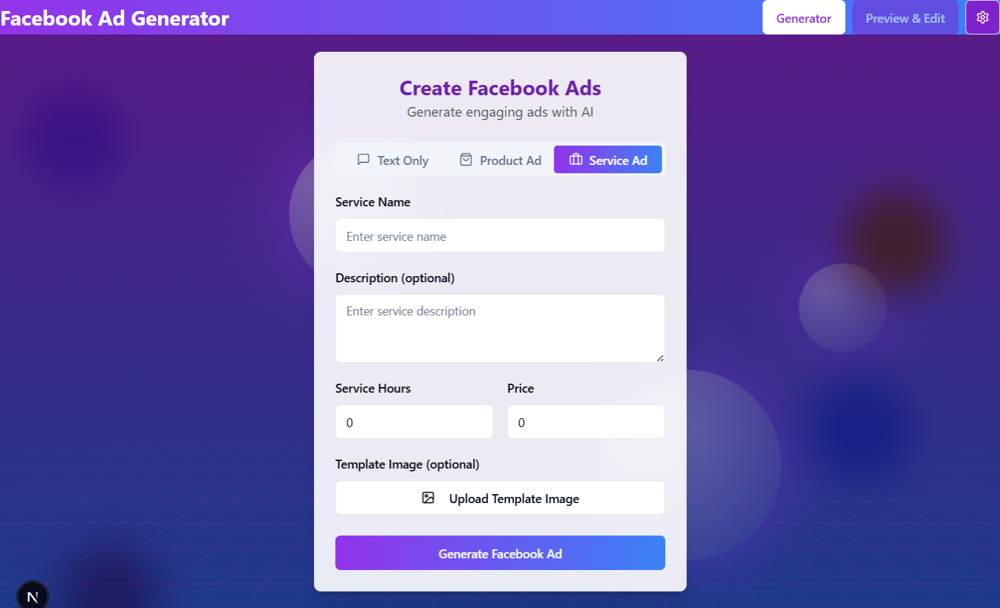
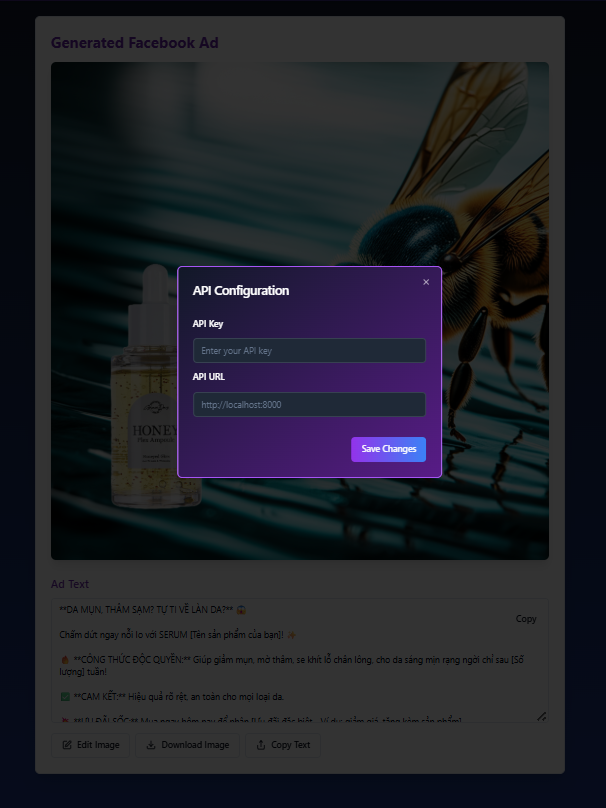
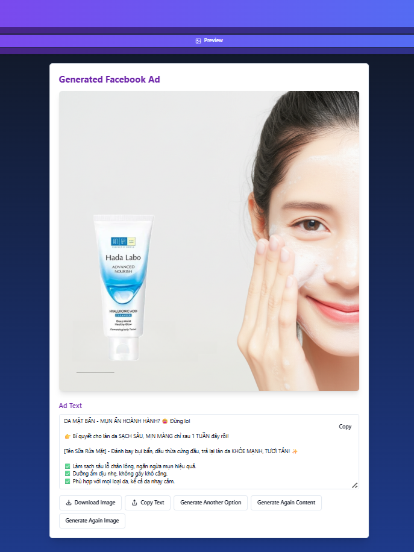
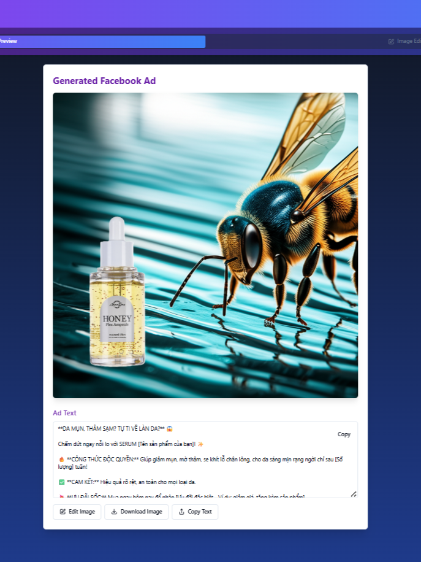

# QuickAdGen - Your AI Poster Generation Powerhouse! 🚀✨

Tired of the endless cycle of designing promotional posters? **QuickAdGen** is your full-stack creative partner, revolutionizing how you craft eye-catching advertising posters! Imagine an intelligent assistant that not only writes compelling ad copy but also designs stunning, ready-to-use posters – all securely and at your command.

---

## ⚡️ Live Demo (Frontend)

Experience QuickAdGen in action:
**[➡️ Click Here to Try QuickAdGen!](https://quickadgen-post-creator-1pm7.vercel.app/)**

Here's a glimpse of the main QuickAdGen interface where you'll define your poster requirements:


---

## See It In Action! (Application Sample)

First, deploy your server and get the API_URL and set up your own apikey for sercurity.



QuickAdGen transforms your inputs into complete advertising posters. Here are a couple of examples:

| Sample Poster 1                                       | Sample Poster 2                                       |
| :----------------------------------------------------: | :----------------------------------------------------: |
|  |  |

## 🎯 What is QuickAdGen?

QuickAdGen is a robust application designed to dramatically accelerate and simplify your advertising poster creation. It combines a user-friendly frontend interface with a sophisticated, secure AI-driven backend to:

*   **Generate Persuasive Ad Copy:** Tailored to your product, audience, and desired tone.
*   **Create Complete Ad Posters:** Automatically designs posters featuring your product, compelling copy, and AI-generated backgrounds.
*   **Iterate with Ease:** Not quite right? Instantly regenerate parts or the entire poster with new variations.
*   **Secure API Integration:** Your backend API keys are managed securely, ensuring controlled access to the AI generation services. Communication between your frontend and backend is protected by a user-defined API key.

## 🛠️ How It Works: The Magic Behind the Curtain

QuickAdGen orchestrates a symphony of frontend and backend technologies, with a strong focus on security and iterative design:

1.  **Your Vision, Securely Submitted (Frontend - Next.js & React):**
    *   You interact with our intuitive web interface, built with **Next.js**, **React**, and styled with **Tailwind CSS** & **Shadcn/ui**.
    *   Simply describe your product, target audience, desired tone, and any specific poster elements.
    *   **Crucially, you configure your own API Key and Backend API URL.** This API key is used by the frontend to authenticate with *your* backend, ensuring only authorized requests access your AI resources. These settings are conveniently saved in your browser's local storage.

2.  **Words That Wow & Poster Assembly (Backend AI - FastAPI, Google Gemini & GenAI):**
    *   Your inputs are securely sent to our robust **FastAPI (Python)** backend, authenticated using the API key you provided.
    *   **Google Gemini** crafts compelling ad copy.
    *   **Google GenAI** (e.g., `gemini-2.0-flash-exp-image-generation`) creates unique background visuals.
    *   The backend then intelligently assembles your product images (if provided), the AI-generated copy, and the AI-generated background into a complete, ready-to-use advertising poster.

3.  **The Grand Reveal & Regeneration Power (Frontend):**
    *   The complete advertising poster is delivered back to your browser.
    *   **Not perfect yet? No problem!** The "Preview & Edit" tab allows you to easily trigger regeneration of the poster, giving you fresh AI-powered alternatives until you're thrilled.

---

## ⚙️ Technology Stack

**Frontend:**

*   **Framework/Library:** Next.js (React Framework)
*   **Language:** TypeScript, JavaScript
*   **Styling:** Tailwind CSS
*   **Component Library:** Shadcn/ui (built on Radix UI)
*   **Icons:** Lucide Icons
*   **State Management:** React Hooks (`useState`, `useEffect`)
*   **Deployment (Demo):** Vercel

**Backend:**

*   **Framework:** FastAPI (Python)
*   **Web Server:** Uvicorn
*   **AI - Text Generation:** Google Gemini (via `google-generativeai` SDK)
*   **AI - Image Generation/Backgrounds:** Google GenAI (`gemini-2.0-flash-exp-image-generation` SDK)
*   **Image Processing:** Pillow (PIL), OpenCV-Python, NumPy
*   **API Security:** FastAPI's dependency injection for API key validation (validating the key sent from frontend).
*   **Configuration:** python-dotenv (for managing Google API keys securely on the backend)
*   **Data Validation:** Pydantic
*   **Concurrency:** asyncio

---

## 🚀 Get QuickAdGen Running Locally

Ready to deploy your own instance or contribute? Here's how:

**Prerequisites:**

*   Git
*   Node.js (v18+) and npm/yarn, OR Bun (for Frontend)
*   Python and pip (for Backend)
*   A Google Cloud Project with the Generative Language API enabled and an API Key for Google Gemini/GenAI.

**1. Clone the Repository:**
   ```bash
   git clone https://github.com/htkngan/quickadgen-post-creator.git
   cd quickadgen-post-creator
  ```
**2. Setup the Backend:**
   ```bash
   cd fastapi/README.md
  ```
**3. Setup the Frontend:**
Use npm:
   ```bash
   npm install
    # or
    # yarn install
    
    # Create a .env.local file in the frontend root.
    # This tells the frontend where your backend is and which key to use:
    # NEXT_PUBLIC_API_URL="http://localhost:8000"
    # NEXT_PUBLIC_BACKEND_API_KEY="your_secret_key_for_frontend_to_use" # Must be one of the VALID_API_KEYS in backend's .env

   npm run dev
  ```
Use Bun:
   ```bash
   cd deloy
   curl -fsSL https://bun.sh/install | bash
   bun install

    # Create a .env.local file in the frontend root.
    # This tells the frontend where your backend is and which key to use:
    # NEXT_PUBLIC_API_URL="http://localhost:8000"
    # NEXT_PUBLIC_BACKEND_API_KEY="your_secret_key_for_frontend_to_use" # Must be one of the VALID_API_KEYS in backend's .env

   bun run dev\bun next build + bun start
  ```
